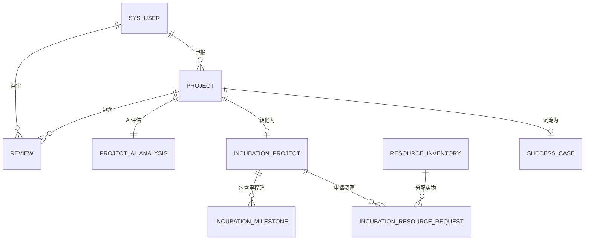

# 图灵数智概念验证与项目孵化管理系统——实验报告

## 一、 需求分析

### 1.1 业务需求描述
本项目旨在解决科技成果转化初期“概念验证”阶段的信息不对称、评审主观性强及资源分配形式化等问题。系统实现了项目全生命周期管理，核心业务流程如下：

1.  **项目申报**：申请人填写项目详情、技术路径及经费预算，上传附件。
2.  **AI 自动化初筛**：系统在提交后异步调用 GLM-4.7 大模型，从创新性、可行性、市场潜力三个维度给出辅助评分及风险预警。
3.  **材料初审与指派**：管理员进行形式审查，并根据项目所属技术领域，从专家库中精准筛选并指派 1-3 名专家。
4.  **同行评议（专家评审）**：多名专家独立对项目进行加权评分（可行性、深度、拓展度）。
5.  **入库决策**：系统自动汇总专家评分，计算平均分。均分 ≥ 60 分的项目自动进入“已入库”状态，并开启孵化流程。
6.  **入孵与导师分配**：申请人签署协议，管理员指派导师并自动生成里程碑。
7.  **实物资源调度**：申请人申请算力、资金、场地等资源，导师根据平台实时库存进行核销分配。
8.  **里程碑审核与结项**：经过中期和终期两次汇报审核，合格项目转化为“成功案例”。

### 1.2 用户角色分析（用例图描述）
*   **项目申报人（APPLICANT）**：
    *   核心操作：提交/修改申报书、查看 AI 预评意见、签署入孵协议、提交里程碑进度报告、申请实物资源、查看我的资产包。
*   **平台运营管理员（ADMIN）**：
    *   核心操作：项目形式审查、指派评审专家、全局资源库存维护（补仓/回收）、里程碑报告初审、用户权限管理。
*   **评审专家/指导老师（EXPERT）**：
    *   核心操作：对分配项目进行多维度评分、作为导师辅导项目、处理资源申请（划拨实物资产）、落成终审打分。

### 1.3 功能性需求列表
*   **用户中心**：支持注册、登录、角色权限控制（RBAC）。
*   **智能申报**：支持多领域勾选、JSON 格式数据存储、附件上传。
*   **AI 智评**：集成智谱 AI API，实现项目质量的自动化异步分析。
*   **精准评审**：支持 1-3 人同行评议，自动计算均分，支持领域内专家自动匹配。
*   **孵化管理**：里程碑自动创建、报告提交与双重审批流。
*   **资源系统**：建立实物台账，支持库存自动扣减与资产持有展示。

### 1.4 非功能性需求
*   **性能**：利用 Spring Boot 异步线程池处理 AI 耗时任务，保证界面不卡顿。
*   **安全性**：前端 Axios 拦截器校验登录态，后端控制非法跨角色访问。
*   **易用性**：响应式布局，针对专家匹配提供“蓝色加粗”智能提示。

---

## 二、 概念结构设计（E-R 图）



---

## 三、 逻辑结构设计

### 3.1 关系模式
1.  **用户表 (sys_user)**：{<u>user_id</u>, username, password, real_name, role, field, company}
2.  **项目表 (project)**：{<u>project_id</u>, project_name, tech_domain, budget, status, applicant_id, final_score}
3.  **专家评审表 (review)**：{<u>review_id</u>, project_id, expert_id, score, comments, status}
4.  **AI分析表 (project_ai_analysis)**：{<u>analysis_id</u>, project_id, innovation_score, feasibility_score, market_score, analysis_summary, risk_warning}
5.  **资源库存表 (resource_inventory)**：{<u>resource_id</u>, resource_name, resource_type, total_quota, remaining_quota, unit}
6.  **资源申请表 (incubation_resource_request)**：{<u>request_id</u>, project_id, type, status, allocated_resource_id, allocated_amount}

---

## 四、 物理结构设计与数据库实施

### 4.1 数据库选择
采用 **MySQL 8.0**，利用其强大的 JSON 处理能力和事务隔离级别。

### 4.2 核心建表语句（部分展示）
```sql
-- 项目信息表
CREATE TABLE `project` (
  `project_id` int NOT NULL AUTO_INCREMENT PRIMARY KEY,
  `project_name` varchar(200) NOT NULL,
  `tech_domain` varchar(200) COMMENT '技术领域(JSON存储)',
  `status` int DEFAULT 0 COMMENT '0-草稿, 1-待审, 2-评审中, 3-已入库, 9-驳回',
  `final_score` decimal(5,2) DEFAULT NULL,
  `applicant_id` int NOT NULL,
  INDEX `idx_status` (`status`)
) ENGINE=InnoDB DEFAULT CHARSET=utf8mb4;

-- 资源库存表
CREATE TABLE `resource_inventory` (
  `resource_id` int NOT NULL AUTO_INCREMENT PRIMARY KEY,
  `resource_name` varchar(100) NOT NULL,
  `resource_type` varchar(50) NOT NULL,
  `remaining_quota` decimal(15,2) NOT NULL,
  `unit` varchar(20)
) ENGINE=InnoDB DEFAULT CHARSET=utf8mb4;
```

### 4.3 数据库试运行（关键查询）
1.  **查询所有处于“评审中”状态的项目及其申报人信息**：
    ```sql
    SELECT p.project_name, u.real_name AS applicant, p.tech_domain 
    FROM project p JOIN sys_user u ON p.applicant_id = u.user_id 
    WHERE p.status = 2;
    ```
2.  **统计各技术领域的项目数量**：
    ```sql
    -- 简易统计（由于tech_domain是JSON，实际业务通过Java解析，此处展示逻辑）
    SELECT tech_domain, COUNT(*) FROM project GROUP BY tech_domain;
    ```
3.  **查询某位专家评审过的所有项目及平均分**：
    ```sql
    SELECT u.real_name, AVG(r.score) as avg_score 
    FROM review r JOIN sys_user u ON r.expert_id = u.user_id 
    WHERE u.username = 'expert1';
    ```

---

## 五、 系统实现

### 5.1 系统目录结构
*   `concept-platform/`：后端 Spring Boot 项目
    *   `controller/`：Restful 接口层
    *   `service/`：业务逻辑层（包含 AI 异步任务与库存计算）
    *   `entity/`：MyBatis-Plus 实体类
*   `concept-platform-frontend/`：前端 Vue 3 项目
    *   `views/`：功能页面（申报、审核、资源、资产等）
    *   `api/`：Axios 请求封装

### 5.2 技术选型
*   **前端**：Vue 3, Element Plus, ECharts, Vite.
*   **后端**：Java 21, Spring Boot 3.4, MyBatis-Plus.
*   **AI**：智谱 AI GLM-4.7 API。

---

## 六、 系统界面展示
*(此处请插入实际运行截图)*
1.  **[截图1：申报页面]** —— 展示结构化申报表单与附件上传。
2.  **[截图2：AI分析弹窗]** —— 展示 GLM-4.7 生成的评分雷达图与建议。
3.  **[截图3：专家分配页面]** —— 展示按领域自动过滤专家的智能界面。
4.  **[截图4：我的资产包]** —— 展示申请人持有的实物资源凭证。

---

## 七、 难点与解决方案

1.  **难点：AI 分析响应慢导致前端阻塞。**
    *   **方案**：在后端引入 `@EnableAsync`，项目提交后立即返回成功，AI 任务在后台线程池独立运行，结果通过状态位标记，前端实现平滑的“加载中”展示。
2.  **难点：实物资源分配的超发风险。**
    *   **方案**：在 Service 层使用 `@Transactional` 事务注解，将“申请处理”与“库存扣减”原子化，并在扣减前进行 `remaining_quota` 的严格余量检查。
3.  **难点：复杂领域的专家精准指派。**
    *   **方案**：设计了 JSON 领域的关键词匹配算法，在管理员指派时，前端动态计算专家擅长领域与项目需求的交集，实现一键筛选。

---
**指导老师评语：**
*(留白)*

